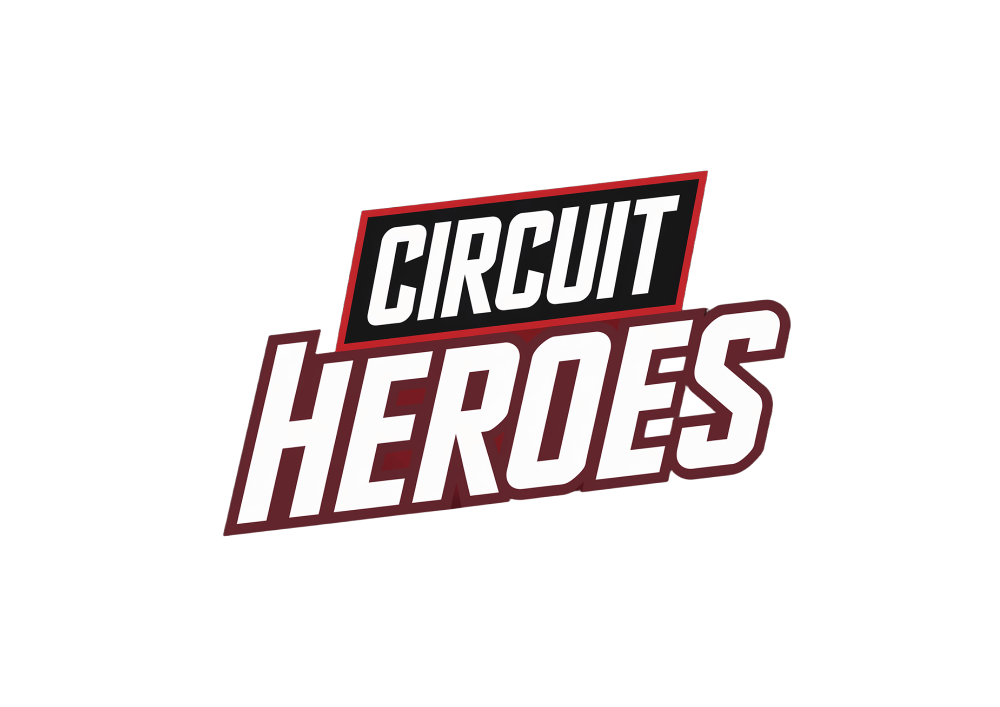

# Circuit Heroes LM



An open-source, electronics-centric TinyLM created by **Laksh** for fully
offline inference on ESP devices.

Circuit Heroes LM combines a compact generative model with a verified local
component catalogue. The catalogue supplies exact names and facts; the model
turns those facts into short beginner explanations, questions, and live game
missions. No cloud API is required after installation.

> Project status: active research preview. The portable runtime and dataset
> pipeline work. Two broad electronics checkpoints were rejected because they
> hallucinated component facts. A new, narrow 52-component pilot passes its
> deterministic in-domain checks, including 52 non-revealing Circuit Quest
> clues, but is not a broad electronics foundation
> model. See [pilot/README.md](pilot/README.md) and
> [docs/BENCHMARKS.md](docs/BENCHMARKS.md).

## Why the factual catalogue matters

A microcontroller model cannot reliably memorize every datasheet. Circuit
Heroes LM therefore uses local retrieval before generation:

```text
question -> local component lookup -> verified fact context -> TinyLM -> verifier -> answer
```

This is still locally generated language, but exact part identity, subtype,
package, polarity, and limits do not depend on guessing.

## Repository contents

- `include/`, `src/`: portable C inference API and INT4 PLE runtime
- `config/`: validated ESP board/display/mic/speaker profiles
- `data/`: 21,349-component KiCad-derived catalogue and manifests
- `tools/`: configuration, dataset, tokenization, and release tools
- `training/`: higher-compute grounded-model training configuration
- `docs/`: architecture, hardware tiers, data, training, and release policy
- `pilot/`: bounded pilot facts, instructions, status, and limitations
- `artifacts/`: locally exported development artifacts; no production release
  is accepted yet

## Quick start

Generate a hardware configuration:

```sh
python3 tools/configure.py \
  --board waveshare-s3-touch-amoled-1.8 \
  --mic modulino-i2s \
  --speaker mini-i2s \
  --output generated/circuitlm_config.h
```

Build the bounded pilot corpus and generated firmware prompt header:

```sh
.venv/bin/python tools/build_pilot.py
.venv/bin/python tools/tokenize_dataset.py \
  --dataset generated/pilot \
  --tokenizer model-tokenizer.json \
  --output generated/pilot-tokens
```

The exact training, evaluation, and export commands are recorded in
[`pilot/README.md`](pilot/README.md).

To prepare the broader experimental corpus instead:

```sh
python3 tools/prepare_dataset.py \
  --catalogue data/electronics_catalogue.tsv \
  --output generated/dataset
python3 tools/tokenize_dataset.py \
  --dataset generated/dataset \
  --tokenizer model-tokenizer.json \
  --output generated/tokens
```

Build a deterministic downloadable bundle only after producing an accepted
model. No production weight bundle is published yet:

```sh
python3 tools/package_release.py \
  --model path/to/model-int4.bin \
  --tokenizer model-tokenizer.json \
  --catalogue data/electronics-pack.bin \
  --output dist/Circuit-Heroes-LM.zip
```

## Supported hardware

The full reference target is the Waveshare ESP32-S3 Touch AMOLED 1.8 with 16
MiB flash and 8 MiB PSRAM. ESP32-S3/P4, S2, C3, and C6 profiles use the same API
but different model tiers. A C3 without PSRAM cannot run the same checkpoint as
an S3 with 8 MiB PSRAM; the configuration tool rejects impossible combinations.

## Authorship and attribution

Circuit Heroes LM was created by **Laksh**. Development assistance and code
generation were provided through OpenAI Codex. The PLE reference inference work
is adapted from `slvDev/esp32-ai` under its MIT license. The electronics
catalogue is derived from the KiCad official symbol library under CC BY-SA 4.0
with the KiCad library exception. See [AUTHORS.md](AUTHORS.md) and `licenses/`.

## License

Project code and released model weights use the MIT license. KiCad-derived
catalogue and training data remain CC BY-SA 4.0 with the KiCad library
exception. Third-party notices remain in `licenses/`.

## Complete release map

- [`models/`](models/README.md): PyTorch checkpoints, ESP32 INT4 weights,
  golden output, hashes, and rejected research checkpoints
- [`datasets/`](datasets/README.md): complete JSONL training, validation, and
  test splits plus provenance and the hardware information layer
- [`docs/REPRODUCIBILITY.md`](docs/REPRODUCIBILITY.md): exact train, evaluate,
  export, host verification, and ESP32 steps
- [`docs/ARCHITECTURE.md`](docs/ARCHITECTURE.md): PLE TinyLM and grounded
  inference method
- [`docs/BENCHMARKS.md`](docs/BENCHMARKS.md): successes, failures, and measured
  ESP32-S3 latency
