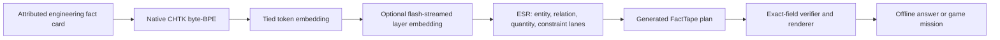

# circuitheroesLM

**circuitheroesLM is a native, electronics-centric language model designed for
fully offline inference on ESP32-class microcontrollers.**

This branch starts from the repository's original one-file `main` history. It
does not contain or import the earlier slvDev-based prototype runtime, model,
exporter, tokenizer, model format, or weights.

## What it is

circuitheroesLM is trained to model engineering language and relationships:
components, subtypes, symbols, pins, units, connections, topology, behavior,
constraints, failure modes, explanations, questions, and game missions. It is
not initialized from TinyStories or another pretrained language model.

The native architecture is the **Engineering State Router (ESR)**: an
attention-free recurrent decoder with four persistent engineering state lanes
and a compact gated channel mixer. Retrieved fact cards provide attributed
engineering knowledge; the learned model turns grounded records into language.



The neural model chooses language structure and task behavior. Exact names,
symbols, behavior descriptions and safety constraints come from the retrieved
local fact card, which prevents a tiny model from inventing absent ratings or
pin facts.

## Current status

The independently implemented v0.3 baseline is complete from training through
ESP32 execution. It passed 864/864 held-out-family checks in float32 and
row-INT8, strict C and sanitizer goldens, and 100 consecutive sequences on a
real ESP32-S3 N16R8. The device produced a complete grounded answer with the
native CHTK tokenizer and FactTape renderer, fully offline.

Measured on the connected 240 MHz ESP32-S3: 39.42 ms/model step (25.37
steps/s), maximum reference error `2.38419e-6`, and no heap change across 700
steps. The end-to-end prompt plus six-token answer took 4.605 s.

This is a bounded engineering pilot with 52 records, not yet a general-purpose
or "perfect" electronics model. A separately versioned per-layer-embedding
candidate is being evaluated; v0.3 remains preserved until another candidate
beats its published gates.

## Downloadable artifacts

| Candidate | Purpose | Parameters | CHLM size | Device step |
| --- | --- | ---: | ---: | ---: |
| `native-esr-facttape-v0.3` | smallest proven baseline | 573,824 | 614,848 B | 39.42 ms |
| `native-esr-ple-v0.4` | best measured validation loss | 1,163,648 | 1,229,312 B | 39.45 ms |

Each model directory contains float weights, native row-INT8 weights, tokenizer
JSON, native CHTK tokenizer, training and corpus manifests, a device golden and
SHA-256 checksums. v0.4 independently adapts the per-layer-embedding principle
published for [Google Gemma 3n](https://ai.google.dev/gemma/docs/gemma-3n); it
is not Gemma and uses no Gemma weights or runtime code.

## Reproduce on a host

```sh
uv run --with pytest pytest -q
cc -std=c11 -O3 -Wall -Wextra -Werror \
  native_runtime/chlm.c native_runtime/host_verify.c -lm -o /tmp/chlm-verify
/tmp/chlm-verify models/native-esr-ple-v0.4/model.chlm \
  models/native-esr-ple-v0.4/model.chlm.golden.bin
```

Run complete local tokenization and grounded generation with the commands in
[`native_runtime/README.md`](native_runtime/README.md). The ESP32-S3 build,
partition map and exact flashing sequence are in the hardware probe guide.

## What may be claimed

It is accurate to say that circuitheroesLM is independently implemented,
trained from random initialization on its declared engineering corpus, and runs
fully offline on the tested ESP32-S3. It is not accurate to call it Gemma, a
general electronics expert, infinitely knowledgeable, or perfect. Scaling the
reviewed fact corpus and adding harder independent evaluations remain active
work.

Read [`docs/NATIVE_ARCHITECTURE.md`](docs/NATIVE_ARCHITECTURE.md) and
[`docs/ORIGINALITY_POLICY.md`](docs/ORIGINALITY_POLICY.md) before making claims
about the project. Reproduce the board result with
[`firmware/esp32_native_probe/README.md`](firmware/esp32_native_probe/README.md).

## Name

The product and model name is exactly **circuitheroesLM**. Lowercase package
identifiers use `circuitheroeslm` only where tooling requires it.

## License

Project implementation: MIT. Attributed datasets keep their own licenses and
notices. Established mathematical ideas are cited; the project does not claim
to have invented recurrent networks, tokenization, quantization, or language
modelling as general concepts.
