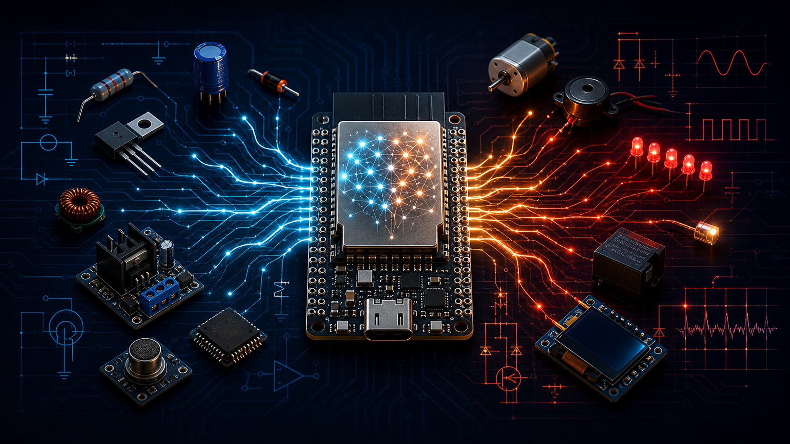
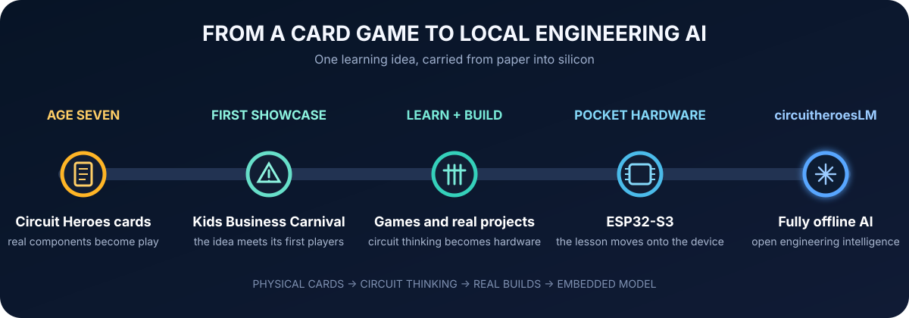
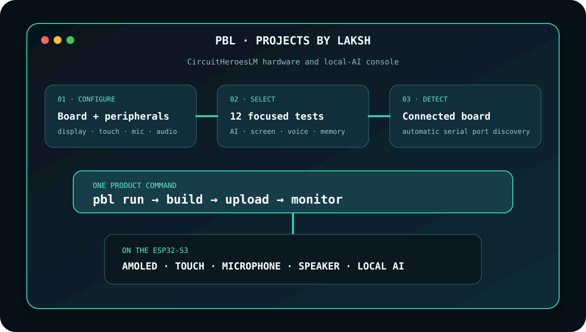
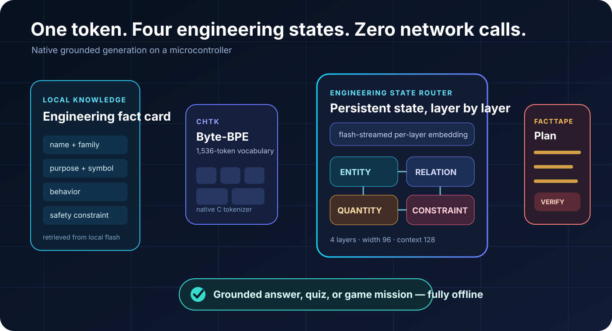
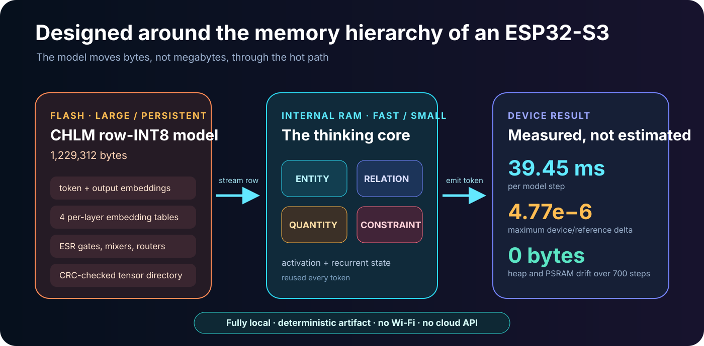
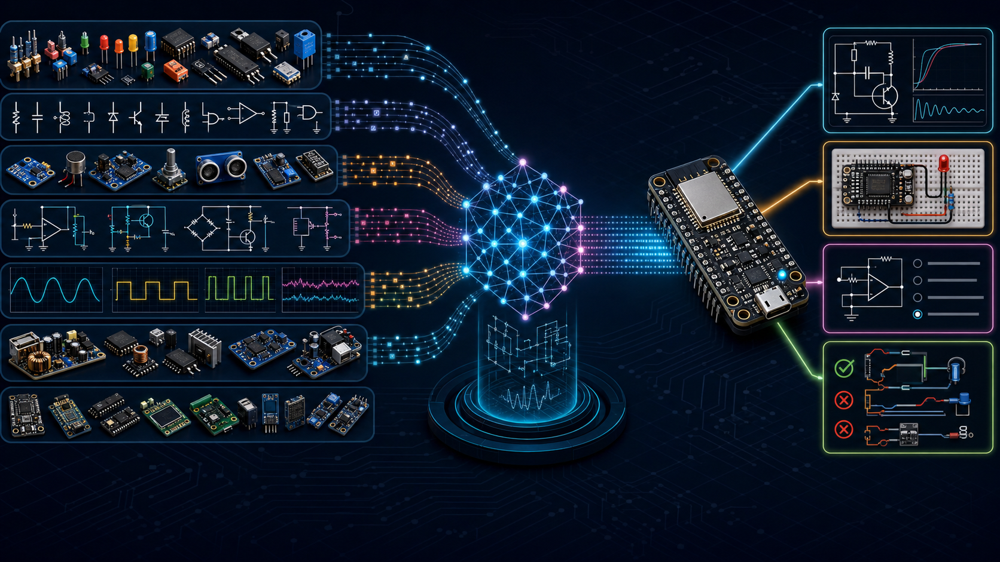
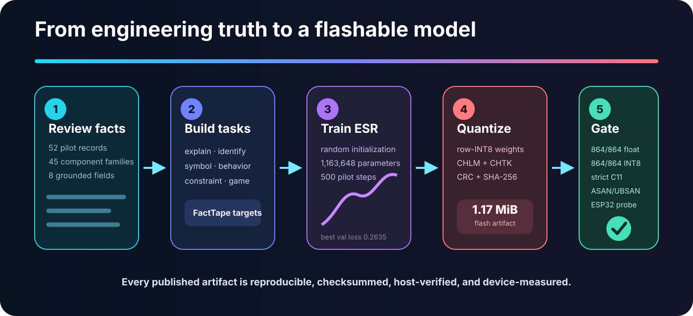

<div align="center">

# circuitheroesLM

### An electronics-native language model built to think where the hardware lives.

**Fully offline · ESP32-S3 measured · Open weights · Native C runtime · Created by Lakshveer Rao**



</div>

circuitheroesLM is an open research stack for compact, grounded electronics
intelligence on microcontrollers. The model, tokenizer, quantizer, binary
format, native runtime, training pipeline, evaluation gates, weights, and
device probe are all published in this repository.

The pilot is intentionally small enough to inspect and reproduce, yet complete
enough to execute real learned inference on a 240 MHz ESP32-S3 with no Wi-Fi,
cloud API, or remote model.

> **Why this matters:** hardware learning tools should still explain, quiz, and
> reason when the internet is absent. circuitheroesLM explores an architecture
> designed around flash bandwidth, tiny recurrent state, verified local facts,
> and the actual memory hierarchy of an embedded device.

## The genesis: a seven-year-old's card game



circuitheroesLM did not begin as a conventional language-model project. Its
starting point was **Circuit Heroes**, the physical electronics-learning card
game Lakshveer Rao designed and began putting into the world at age seven. The
cards made processors, sensors, drivers, outputs, displays, power, and real
circuit relationships playable before a child needed a workbench.

That first idea became a wider learning ecosystem: public game showcases,
builds made by children, several deck and game formats, and—according to the
current Circuit Heroes product site—more than 300 families reached worldwide.
circuitheroesLM carries the same idea into its next form: a tiny, downloadable
engineering model that can teach and create activities directly on pocket
hardware, without sending a child's questions to the cloud.

Read [the full Circuit Heroes origin story](docs/ABOUT.md), explore the
[Circuit Heroes website](https://www.circuitheroes.com/), or continue below
for the measured model architecture and reproducible device evidence.

## The result, at a glance

| What was measured | v0.4 result |
| --- | ---: |
| Model architecture | Engineering State Router + per-layer embeddings |
| Parameters | 1,163,648 |
| Quantized CHLM artifact | 1,229,312 bytes (1.17 MiB) |
| ESP32-S3 model step | 39.45 ms |
| Compute rate | 25.35 steps/s |
| Device/reference maximum delta | `4.76837e-6` |
| Device numerical run | 100 sequences / 700 steps |
| Heap drift across run | 0 bytes |
| PSRAM drift across run | 0 bytes |
| Grounded on-device answer | 4.608 s end to end |
| Held-out task gates | 864/864 float + 864/864 row-INT8 |

Test board: ESP32-S3 N16R8, 240 MHz, 16 MB flash, 8 MB PSRAM. These are
recorded measurements from the connected device, not simulator estimates.
The complete evidence is in
[`docs/NATIVE_RESULTS.md`](docs/NATIVE_RESULTS.md).

## Start with PBL — no pip or UV required

**PBL (Projects by Laksh)** is the product interface for this repository. It is
a dependency-free terminal dashboard built with Python's standard library. It
detects connected ESP boards, remembers the user's hardware, builds the right
firmware, uploads it, writes model partitions when required, and opens the
serial monitor.

### Zero-clone install

macOS, Linux, and Ubuntu Touch:

```sh
curl -fsSL https://raw.githubusercontent.com/lakshveerrao/circuitheroesLM/main/install-pbl.py | python3
pbl
```

Windows PowerShell:

```powershell
irm https://raw.githubusercontent.com/lakshveerrao/circuitheroesLM/main/install-pbl.py | py -3 -
pbl
```

This performs the unavoidable first transfer automatically. Users do not clone
Git, manage a repository, run pip, copy files, or use Arduino CLI. After that,
`pbl` opens the Projects by Laksh terminal from anywhere.

### Repository edition

```sh
./pbl
```

That opens the interactive terminal dashboard. Nothing has to be installed.
The dashboard uses arrow keys or W/S plus Enter, and works with standard
terminal keypads on macOS, Linux, Windows and Ubuntu Touch.
To make `pbl` available everywhere as a normal command, use the optional
one-time, pip-free installer:

```sh
./pbl install
export PATH="$HOME/.local/bin:$PATH"
pbl
```

The most useful direct commands are:

```sh
pbl configure               # processor, board, display, input, mic, speaker
pbl detect-port             # find the connected ESP board
pbl test-codes              # browse the hardware/AI example library
pbl select board-full-lab   # remember a test code
pbl run                     # build + upload + monitor
```

Option-style commands are accepted too: `pbl --run`, `pbl --upload`,
`pbl --detect-port`, `pbl --configure`, and `pbl --test-codes`. Use
`pbl doctor` to check Python, firmware tools, the compiler, the test catalog,
and the connected serial device from one screen. The pip-free installer also provides
the compact aliases requested for scripting: `pbl--run`, `pbl--upload`,
`pbl--detect-port`, `pbl--configure`, and `pbl--test-codes`.



### Included test-code library

PBL ships with 12 discoverable examples rather than a serial-only model probe:

- native CircuitHeroesLM numerical, speed, memory, tokenizer, and generation
  validation;
- interactive full-board AMOLED, touch, microphone, and speaker laboratory;
- display color/alignment and full-panel touch tracking;
- a silent-until-tapped, low-volume speaker check;
- a live microphone level meter;
- three-second local record and one-time playback;
- a Circuit Heroes agent UI hardware bridge;
- I2C/BSP, SRAM/PSRAM, chip/flash, and serial heartbeat checks.

The Waveshare examples support both the original SH8601/FT3168 board and the
V2 CO5300/CST820 board through the official managed BSP. PBL marks examples
that do not match the configured processor or board and requires an explicit
override before building them.

## What is genuinely new here

circuitheroesLM combines several ideas into a microcontroller-first engineering
system:

1. **Engineering State Router (ESR).** An attention-free recurrent decoder with
   four persistent state lanes—entity, relation, quantity, and constraint—so
   the hot thinking state stays compact.
2. **Flash-streamed per-layer embeddings.** Layer-specific token knowledge is
   read a row at a time from mapped model flash instead of becoming a permanent
   RAM burden.
3. **Grounded neural planning.** The learned model produces a compact FactTape
   plan; an exact-field verifier renders names, symbols, behavior, and safety
   facts from the retrieved local record.
4. **An embedded-native artifact chain.** CHTK tokenization, row-INT8 CHLM
   weights, CRC-checked tensor metadata, C11 inference, and ESP-IDF firmware are
   designed and tested together.
5. **Reproducible claims.** Float, quantized Python, native C, sanitizer, and
   real-device gates are included alongside the weights that produced the
   numbers.

The innovation is the measured system design: useful engineering generation
under microcontroller constraints, with the generative and factual parts
separated so a tiny model can be creative without fabricating a pin name or
safety constraint.



## How a response is made

1. A reviewed engineering record is retrieved from local storage.
2. The native CHTK byte-BPE tokenizer converts the card and request into tokens.
3. Each ESR layer receives its token embedding plus that layer's flash-streamed
   embedding row.
4. Four recurrent lanes track the component, relationship, quantity, and
   constraint information needed for the next token.
5. The model generates FactTape control tokens for an explanation, symbol clue,
   behavior lesson, safety rule, quiz, or game mission.
6. The verifier copies exact grounded fields into the final response.

This creates a practical division of labor: the neural model learns language
structure and task behavior; the local knowledge card supplies exact
engineering truth.

## Built for ESP32 memory, not resized for it



The v0.4 CHLM file stays in its model partition. Quantized rows are read from
mapped flash as inference needs them, while activations and four recurrent
states occupy the fast working path. The implementation does not need to stage
the entire model in PSRAM.

The current downloadable artifact:

```text
models/native-esr-ple-v0.4/model.chlm
SHA-256 023af982de1a56bd35b34e4d6f9faaa115ed1554b2c113ded11cd3b7b83f2ac2
```

## Engineering data, made inspectable



The current Engineering HIL pilot contains **52 reviewed component records**
across **45 component families**. Every record uses eight explicit fields:

- stable ID and human-readable name;
- engineering family;
- purpose;
- schematic-symbol description;
- operating behavior;
- safety or selection constraint;
- retrieval anchors.

From each fact card, the pipeline creates six learning modes: **explain,
identify, symbol, behavior, constraint, and game**. Dataset records, review
status, manifests, generation contracts, and evaluation outputs remain visible
instead of being hidden behind a training service.

The pilot proves the complete method; it does not yet claim broad coverage of
all electronics. The next scale target is a much larger, license-reviewed
corpus spanning components, modules, pins, circuits, measurements, debugging,
power electronics, robotics, embedded systems, and safe connection patterns.



## Download the model

| Release candidate | Role | Parameters | CHLM bytes | Board result |
| --- | --- | ---: | ---: | ---: |
| [`native-esr-ple-v0.4`](models/native-esr-ple-v0.4) | best measured pilot | 1,163,648 | 1,229,312 | 39.45 ms/step |
| [`native-esr-facttape-v0.3`](models/native-esr-facttape-v0.3) | compact preserved baseline | 573,824 | 614,848 | 39.42 ms/step |

Each candidate directory includes:

- PyTorch weights (`model.pt`);
- native row-INT8 weights (`model.chlm`);
- tokenizer JSON and native CHTK binary;
- corpus and training manifests;
- device golden tensors;
- evaluation outputs;
- SHA-256 checksums.

## Reproduce the research pipeline

PBL is the recommended interface for normal board use. The commands below are
the lower-level research workflow for training, evaluation and runtime work.

### 1. Run the tests

```sh
uv run --with pytest pytest -q
```

### 2. Build and verify the native C runtime

```sh
cc -std=c11 -O3 -Wall -Wextra -Werror \
  native_runtime/chlm.c native_runtime/host_verify.c -lm \
  -o /tmp/chlm-verify

/tmp/chlm-verify \
  models/native-esr-ple-v0.4/model.chlm \
  models/native-esr-ple-v0.4/model.chlm.golden.bin
```

### 3. Run complete native tokenization and grounded generation

Follow [`native_runtime/README.md`](native_runtime/README.md) for the CHTK +
CHLM generation command.

### 4. Build, flash, and measure the ESP32-S3

The exact ESP-IDF project, model partition, flash commands, serial protocol,
and pass marker are in
[`firmware/esp32_native_probe/README.md`](firmware/esp32_native_probe/README.md).

## Repository map

```text
src/circuitheroeslm/          ESR model, tokenizer, CHLM format, generation
tools/                        dataset build, training, export, evaluation
native_runtime/               portable C11 tokenizer, inference, generation
firmware/esp32_native_probe/  ESP-IDF hardware validation firmware
firmware/pbl_waveshare_lab/   display, touch, mic and speaker test firmware
firmware/pbl_system_probe/    portable chip and serial starter firmware
pbl + pbl_cli/                dependency-free product CLI and test registry
data/                         reviewed Engineering HIL pilot
models/                       weights, tokenizers, manifests, checksums
evaluations/                  float and quantized held-out results
docs/                         architecture, formats, results, methodology
```

## Research honesty

circuitheroesLM v0.4 is a successful **engineering pilot**, not a finished
general electronics expert. It has a small reviewed corpus, a short context,
and a deliberately constrained grounded renderer. “AI-powered” here means a
trained neural model is genuinely executing on the ESP32-S3; it does not mean
that the pilot already knows every component or can replace engineering review.

The strongest claim we make today is concrete: **an original
electronics-focused model stack was trained from random initialization,
quantized into its own embedded format, executed through its native C runtime,
and validated end to end on a real ESP32-S3—fully offline.**

## Method attribution

The per-layer-embedding direction is inspired by the technique published by
Google for [Gemma 3n](https://ai.google.dev/gemma/docs/gemma-3n). In
circuitheroesLM it is adapted to a small ESR decoder and streamed from mapped
microcontroller flash. Dataset sources and licenses are tracked in the corpus
manifests and [`licenses/`](licenses/); the current engineering fact review
includes KiCad-derived reference work under its published terms.

Established ideas such as recurrent neural networks, byte-pair tokenization,
and integer quantization retain their normal research lineage. Project code and
original assets are released under the repository license.

## Roadmap

- scale from 52 pilot records to thousands of reviewed engineering facts;
- add pins, packages, ratings, connection graphs, and circuit-level tasks;
- benchmark retrieval, generation quality, latency, power, and failure modes;
- add ESP32-P4, ESP32-C6, ESP32-C3, and display/audio board profiles where the
  model size and peripherals permit;
- train larger teacher models and distill stronger embedded candidates;
- ship a versioned model registry and downloadable release bundles;
- integrate the model into the Circuit Heroes offline learning game.

## Author and license

Created by **Lakshveer Rao** as the open foundation for Circuit Heroes and
future offline engineering-learning products. The project continues a journey
that began when Laksh designed the first Circuit Heroes electronics-learning
card game at age seven. See [`docs/ABOUT.md`](docs/ABOUT.md) and
[Lakshveer's builder portfolio](https://lakshveer.com/).

Project implementation: MIT. Dataset and reference materials retain their
respective licenses and notices.
